# Complete Course Registration System Architecture

## Executive Summary

This document provides a comprehensive overview of the **Course Registration System**, a high-performance, scalable microservices architecture built with Go, featuring **Redis Sentinel High Availability**, **idempotency controls**, **asynchronous queue processing**, and **real-time seat management**. The system is designed to handle concurrent registrations from thousands of students while maintaining data consistency and providing sub-second response times.

## Table of Contents

1. [System Overview](#system-overview)
2. [Complete Architecture Diagram](#complete-architecture-diagram)
3. [Redis Sentinel High Availability](#redis-sentinel-high-availability)
4. [Idempotency Implementation](#idempotency-implementation)
5. [Queue Processing System](#queue-processing-system)
6. [API Endpoints](#api-endpoints)
7. [Sequence Diagrams](#sequence-diagrams)
8. [Performance Characteristics](#performance-characteristics)
9. [Deployment Architecture](#deployment-architecture)
10. [Monitoring & Observability](#monitoring--observability)

## System Overview

### Key Features
- ✅ **High Availability**: Redis Sentinel with 1 master + 2 slaves configuration
- ✅ **Idempotency**: Redis-based idempotency keys prevent duplicate registrations
- ✅ **Asynchronous Processing**: Multi-queue system for database synchronization
- ✅ **Concurrency Control**: Atomic operations with optimistic locking
- ✅ **Real-time Waitlist**: Automatic waitlist processing when seats become available
- ✅ **Performance**: Tested with 6,978 concurrent users, sub-second response times
- ✅ **Data Consistency**: min-slaves-to-write=2 ensures write safety

### Technology Stack
- **Backend**: Go 1.21+ with Gin framework
- **Database**: PostgreSQL 15 with GORM ORM
- **Cache**: Redis 7 with Sentinel clustering
- **Container**: Docker & Docker Compose
- **Architecture**: Clean Architecture with Domain-Driven Design
- **Testing**: K6 for load testing, integrated test data generation

## Complete Architecture Diagram
```mermaid
graph TB
    subgraph "Client Layer"
        Web[Web Client<br/>React/Vue/Angular]
        Mobile[Mobile App<br/>iOS/Android]
        API_Client[API Client<br/>External Systems]
    end
    
    subgraph "Load Balancing & API Gateway"
        LB[Load Balancer<br/>Nginx/HAProxy<br/>Port: 80/443]
        API[API Gateway<br/>Gin Router<br/>Port: 8080]
    end
    
    subgraph "Application Layer"
        subgraph "Handlers"
            RegHandler[Registration Handler<br/>Register/Drop/GetStatus]
            HealthHandler[Health Handler<br/>Health/Ready/Live]
        end
        
        subgraph "Middleware"
            IdempMiddleware[Idempotency Middleware<br/>Duplicate Prevention]
            LogMiddleware[Logging Middleware<br/>Request/Response Logging]
            CORSMiddleware[CORS Middleware<br/>Cross-Origin Support]
        end
        
        subgraph "Services"
            RegService[Registration Service<br/>Core Business Logic]
            IdempService[Idempotency Service<br/>Key Management]
        end
        
        subgraph "Repositories"
            StudentRepo[Student Repository<br/>CRUD Operations]
            SectionRepo[Section Repository<br/>Seat Management]
            RegRepo[Registration Repository<br/>Enrollment Records]
            WaitlistRepo[Waitlist Repository<br/>Queue Management]
            IdempRepo[Idempotency Repository<br/>Redis-based Storage]
        end
    end
    
    subgraph "Queue & Cache Layer"
        subgraph "Redis Sentinel Cluster"
            RedisMaster[Redis Master<br/>Port: 6379<br/>min-slaves-to-write: 2]
            RedisSlave1[Redis Slave 1<br/>Port: 6380<br/>Read Replica]
            RedisSlave2[Redis Slave 2<br/>Port: 6381<br/>Read Replica]
            
            Sentinel1[Redis Sentinel 1<br/>Port: 26379<br/>Monitor & Failover]
            Sentinel2[Redis Sentinel 2<br/>Port: 26380<br/>Monitor & Failover]
            Sentinel3[Redis Sentinel 3<br/>Port: 26381<br/>Monitor & Failover]
        end
        
        subgraph "Queue System"
            DBQueue[Database Sync Queue<br/>Create/Update Operations]
            WaitlistQueue[Waitlist Queue<br/>Position Management]
            WLEntryQueue[Waitlist Entry Queue<br/>Entry Processing]
            
            DBWorkers[DB Sync Workers<br/>Pool of 10 Workers]
            WLWorkers[Waitlist Workers<br/>Pool of 10 Workers]
            WLEntryWorkers[Waitlist Entry Workers<br/>Pool of 10 Workers]
        end
        
        subgraph "Cache Data"
            SeatCache[Seat Availability Cache<br/>Atomic Counters]
            IdempKeys[Idempotency Keys<br/>TTL: 24 hours]
            WaitlistData[Waitlist Positions<br/>Sorted Sets]
        end
    end
    
    subgraph "Data Layer"
        DB[PostgreSQL Database<br/>Port: 5432<br/>Primary Data Store]
        
        subgraph "Database Tables"
            Students[Students Table<br/>User Information]
            Courses[Courses Table<br/>Course Catalog]
            Sections[Sections Table<br/>Class Sections]
            Registrations[Registrations Table<br/>Enrollment Records]
            Waitlist[Waitlist Table<br/>Queue Entries]
            Semesters[Semesters Table<br/>Academic Periods]
        end
    end
    
    subgraph "Infrastructure Layer"
        subgraph "Health Monitoring"
            HealthEndpoint[/health Endpoint<br/>System Status/]
            ReadyEndpoint[/ready Endpoint<br/>Readiness Check/]
            LiveEndpoint[/live Endpoint<br/>Liveness Check/]
        end
        
        subgraph "Observability"
            Logs[Application Logs<br/>Structured Logging]
            Metrics[Performance Metrics<br/>Queue & Response Times]
            Monitoring[System Monitoring<br/>Resource Usage]
        end
    end
    
    %% Client connections
    Web --> LB
    Mobile --> LB
    API_Client --> LB
    
    %% Load balancer to API Gateway
    LB --> API
    
    %% API Gateway to Middleware
    API --> IdempMiddleware
    API --> LogMiddleware
    API --> CORSMiddleware
    
    %% Middleware to Handlers
    IdempMiddleware --> RegHandler
    IdempMiddleware --> HealthHandler
    LogMiddleware --> RegHandler
    LogMiddleware --> HealthHandler
    CORSMiddleware --> RegHandler
    
    %% Handlers to Services
    RegHandler --> RegService
    RegHandler --> IdempService
    HealthHandler --> HealthEndpoint
    HealthHandler --> ReadyEndpoint
    HealthHandler --> LiveEndpoint
    
    %% Services to Repositories
    RegService --> StudentRepo
    RegService --> SectionRepo
    RegService --> RegRepo
    RegService --> WaitlistRepo
    IdempService --> IdempRepo
    
    %% Repository to Cache/DB
    StudentRepo --> DB
    SectionRepo --> DB
    SectionRepo --> SeatCache
    RegRepo --> DB
    WaitlistRepo --> DB
    WaitlistRepo --> WaitlistData
    IdempRepo --> IdempKeys
    
    %% Queue Processing
    RegService --> DBQueue
    RegService --> WaitlistQueue
    
    DBQueue --> DBWorkers
    WaitlistQueue --> WLWorkers
    WLEntryQueue --> WLEntryWorkers
    
    DBWorkers --> DB
    WLWorkers --> WLEntryQueue
    WLEntryWorkers --> DB
    
    %% Redis Sentinel Relationships
    Sentinel1 -.->|Monitor| RedisMaster
    Sentinel2 -.->|Monitor| RedisMaster
    Sentinel3 -.->|Monitor| RedisMaster
    
    Sentinel1 -.->|Monitor| RedisSlave1
    Sentinel2 -.->|Monitor| RedisSlave1
    Sentinel3 -.->|Monitor| RedisSlave1
    
    Sentinel1 -.->|Monitor| RedisSlave2
    Sentinel2 -.->|Monitor| RedisSlave2
    Sentinel3 -.->|Monitor| RedisSlave2
    
    RedisMaster -->|Replicate| RedisSlave1
    RedisMaster -->|Replicate| RedisSlave2
    
    %% Database relationships
    DB --> Students
    DB --> Courses
    DB --> Sections
    DB --> Registrations
    DB --> Waitlist
    DB --> Semesters
    
    %% Cache relationships
    RedisMaster --> SeatCache
    RedisMaster --> IdempKeys
    RedisMaster --> WaitlistData
    
    %% Infrastructure monitoring
    RegService --> Logs
    RegService --> Metrics
    API --> Monitoring
    
    %% Styling
    classDef clientLayer fill:#e3f2fd
    classDef loadBalancer fill:#f3e5f5
    classDef application fill:#e8f5e8
    classDef cache fill:#fff3e0
    classDef database fill:#fce4ec
    classDef infrastructure fill:#f1f8e9
    classDef sentinel fill:#ffecb3
    
    class Web,Mobile,API_Client clientLayer
    class LB,API loadBalancer
    class RegHandler,HealthHandler,IdempMiddleware,LogMiddleware,CORSMiddleware,RegService,IdempService,StudentRepo,SectionRepo,RegRepo,WaitlistRepo,IdempRepo application
    class RedisMaster,RedisSlave1,RedisSlave2,DBQueue,WaitlistQueue,WLEntryQueue,DBWorkers,WLWorkers,WLEntryWorkers,SeatCache,IdempKeys,WaitlistData cache
    class DB,Students,Courses,Sections,Registrations,Waitlist,Semesters database
    class HealthEndpoint,ReadyEndpoint,LiveEndpoint,Logs,Metrics,Monitoring infrastructure
    class Sentinel1,Sentinel2,Sentinel3 sentinel
```

## Redis Sentinel High Availability

### Architecture Overview

Our Redis Sentinel implementation provides **automatic failover** and **write safety** through a carefully configured cluster:

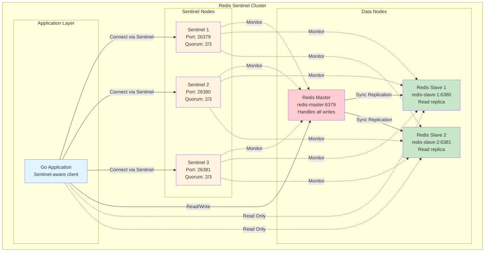

### Why min-slaves-to-write = 2?

We configured `min-slaves-to-write = 2` for **maximum data safety**:

#### ✅ **Advantages**
1. **Zero Data Loss**: Writes only succeed when data is replicated to both slaves
2. **Split-Brain Prevention**: Master cannot accept writes during network partitions
3. **Consistency Guarantee**: All successful writes are safely replicated
4. **Automatic Rollback**: Failed writes don't leave the system in inconsistent state

#### ⚠️ **Trade-offs**
1. **Reduced Availability**: Writes fail if <2 slaves are connected
2. **Increased Latency**: ~2-5ms additional latency for slave acknowledgment
3. **Network Sensitivity**: Temporary network issues can block writes

#### 🎯 **Why We Chose This Configuration**

For a **course registration system**, data consistency is **more important** than raw availability:

- **Lost registrations** = angry students and administrative issues
- **Brief downtime** during failover is acceptable (typically <10 seconds)
- **Course registration** is typically time-bounded (registration periods)
- **Read operations** (checking availability) can continue via slaves

### Failover Process

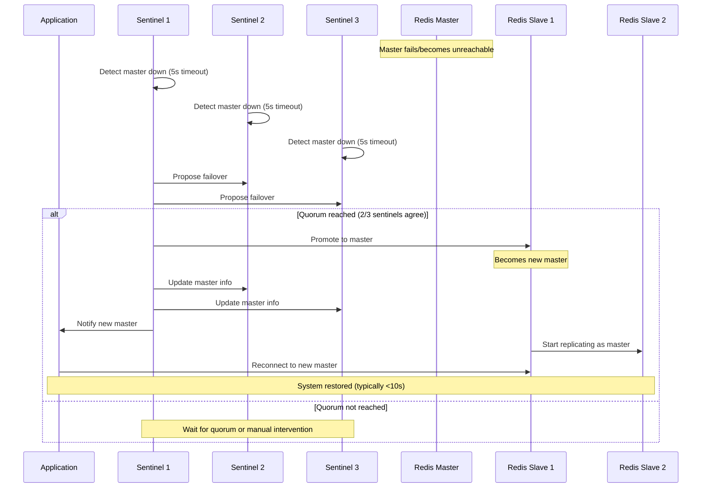

### Redis Data Structures Used

Our system leverages specific Redis data structures for optimal performance:

```mermaid
%%{init: {'flowchart': {'htmlLabels': true}}}%%
graph LR
    subgraph "Seat Management"
        SeatKeys[seat:section:&#123;id&#125;<br/>Integer - Atomic counter<br/>DECR/INCR operations]
    end
    
    subgraph "Idempotency"
        IdempKeys[idempotency_key:&#123;key&#125;<br/>Hash - JSON serialized data<br/>TTL: 24 hours]
    end
    
    subgraph "Queue System"
        DBSync[queue:database_sync<br/>List - FIFO queue<br/>LPUSH/RPOP operations]
        Waitlist[queue:waitlist<br/>List - FIFO queue<br/>LPUSH/RPOP operations]
        WLEntry[queue:waitlist_entry<br/>List - FIFO queue<br/>LPUSH/RPOP operations]
    end
    
    subgraph "Waitlist Positions"
        WLPos[waitlist:section:&#123;id&#125;<br/>Sorted Set - Position tracking<br/>ZADD/ZREM/ZRANGE operations]
    end
    
    style SeatKeys fill:#ffcdd2
    style IdempKeys fill:#c8e6c9
    style DBSync fill:#fff3e0
    style Waitlist fill:#fff3e0
    style WLEntry fill:#fff3e0
    style WLPos fill:#e1f5fe
```

#### Data Structure Details

1. **Seat Counters** (`seat:section:{id}`)
   - **Type**: Integer
   - **Operations**: `DECR` (reserve), `INCR` (release), `GET` (check)
   - **Atomic**: Thread-safe operations prevent race conditions
   - **TTL**: None (persistent until manually cleared)

2. **Idempotency Keys** (`idempotency_key:{key}`)
   - **Type**: Hash (JSON serialized)
   - **Operations**: `HSET`, `HGET`, `EXISTS`, `EXPIRE`
   - **TTL**: 24 hours (configurable)
   - **Contains**: Request hash, response data, student ID, timestamps

3. **Queue Lists** (`queue:{type}`)
   - **Type**: List
   - **Operations**: `LPUSH` (enqueue), `BRPOP` (dequeue with blocking)
   - **Workers**: Multiple consumers with blocking operations
   - **Persistence**: Survives Redis restarts

4. **Waitlist Positions** (`waitlist:section:{id}`)
   - **Type**: Sorted Set
   - **Score**: Position number (1, 2, 3...)
   - **Member**: Student ID
   - **Operations**: `ZADD`, `ZREM`, `ZRANGE`

## Idempotency Implementation

### Overview

Our idempotency system prevents duplicate registrations and ensures consistent responses during network issues or client retries.

```mermaid
%%{init: {'flowchart': {'htmlLabels': true}}}%%
graph TB
    subgraph "Idempotency Flow"
        Request[Client Request<br/>with Idempotency Key]
        KeyCheck{Check Key<br/>Exists?}
        HashCheck{Same Request<br/>Hash?}
        ProcessRequest[Process New Request]
        ReturnCached[Return Cached Response]
        ReturnError[Return Error<br/>Key Mismatch]
        StoreResponse[Store Response<br/>TTL: 24h]
        
        Request --> KeyCheck
        KeyCheck -->|No| ProcessRequest
        KeyCheck -->|Yes| HashCheck
        HashCheck -->|Yes| ReturnCached
        HashCheck -->|No| ReturnError
        ProcessRequest --> StoreResponse
        StoreResponse --> ReturnCached
    end
    
    subgraph "Redis Storage"
        IdempKey[idempotency_key:&#123;key&#125;]
        IdempKey --> KeyData
    end
    
    Request -.-> IdempKey
    StoreResponse -.-> IdempKey
    ReturnCached -.-> IdempKey
    
    style ProcessRequest fill:#c8e6c9
    style ReturnCached fill:#e1f5fe
    style ReturnError fill:#ffcdd2
    style IdempKey fill:#fff3e0

```

### Key Features

1. **Flexible Key Sources**
   - Request body: `"idempotency_key": "unique-key"`
   - HTTP header: `Idempotency-Key: unique-key`
   - Auto-generation available if needed

2. **Request Fingerprinting**
   - SHA-256 hash of student ID + section IDs
   - Ensures only identical requests are considered duplicates
   - Prevents key reuse with different data

3. **Response Caching**
   - Full response data stored in Redis
   - 24-hour TTL (configurable)
   - Instant return for duplicate requests

4. **Error Handling**
   - Same key with different data = HTTP 400 error
   - Non-existent keys = normal processing
   - Redis failures = graceful degradation

### Implementation Flow

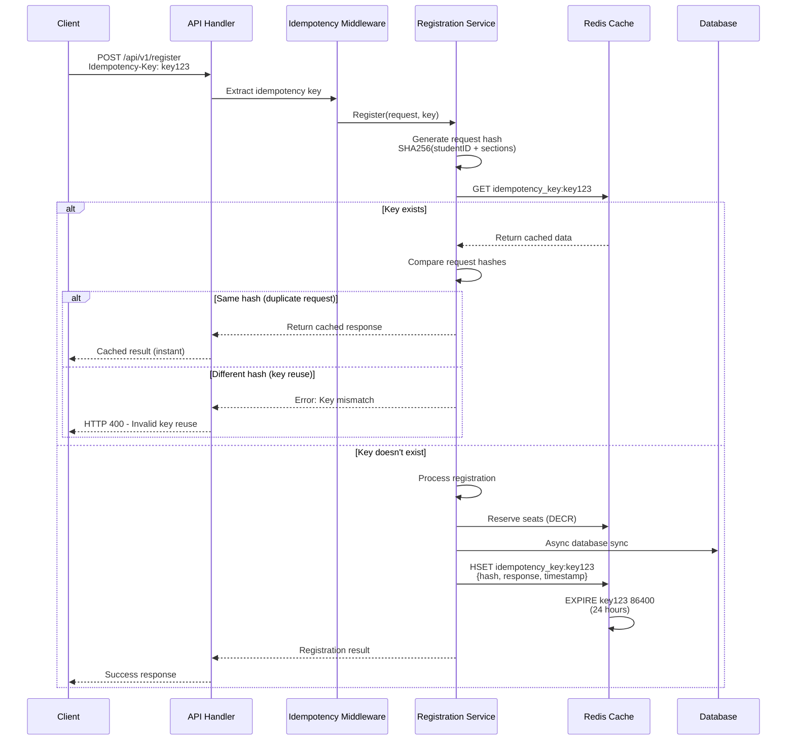
****
## Queue Processing System

### Multi-Queue Architecture

Our asynchronous processing system uses **three specialized queues** to handle different types of operations:

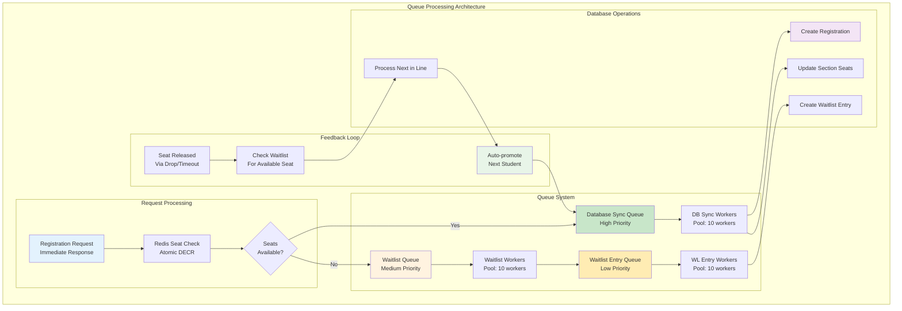

### Queue Types and Purposes

1. **Database Sync Queue** (`queue:database_sync`)
   - **Purpose**: Synchronize successful seat reservations with database
   - **Priority**: High (processed immediately)
   - **Operations**: Create registration records, update seat counts
   - **Workers**: 10 concurrent workers
   - **Retry**: Exponential backoff for failures

2. **Waitlist Queue** (`queue:waitlist`)
   - **Purpose**: Process students who couldn't get seats
   - **Priority**: Medium (processed after DB sync)
   - **Operations**: Create waitlist entries, manage positions
   - **Workers**: 10 concurrent workers
   - **Logic**: Creates entries in waitlist_entry queue

3. **Waitlist Entry Queue** (`queue:waitlist_entry`)
   - **Purpose**: Actually create waitlist database records
   - **Priority**: Low (processed last)
   - **Operations**: Insert waitlist records with positions
   - **Workers**: 10 concurrent workers
   - **Position**: Auto-calculated based on existing entries

### Worker Pool Configuration

```go
// Worker pool configuration
type QueueConfig struct {
    DatabaseSyncWorkers:   10  // High-priority operations
    WaitlistWorkers:       10  // Medium-priority operations  
    WaitlistEntryWorkers:  10  // Low-priority operations
    RetryAttempts:         3   // Max retry attempts
    RetryDelayMs:          100 // Initial retry delay
    MaxRetryDelayMs:       5000 // Maximum retry delay
}
```

### Queue Processing Flow

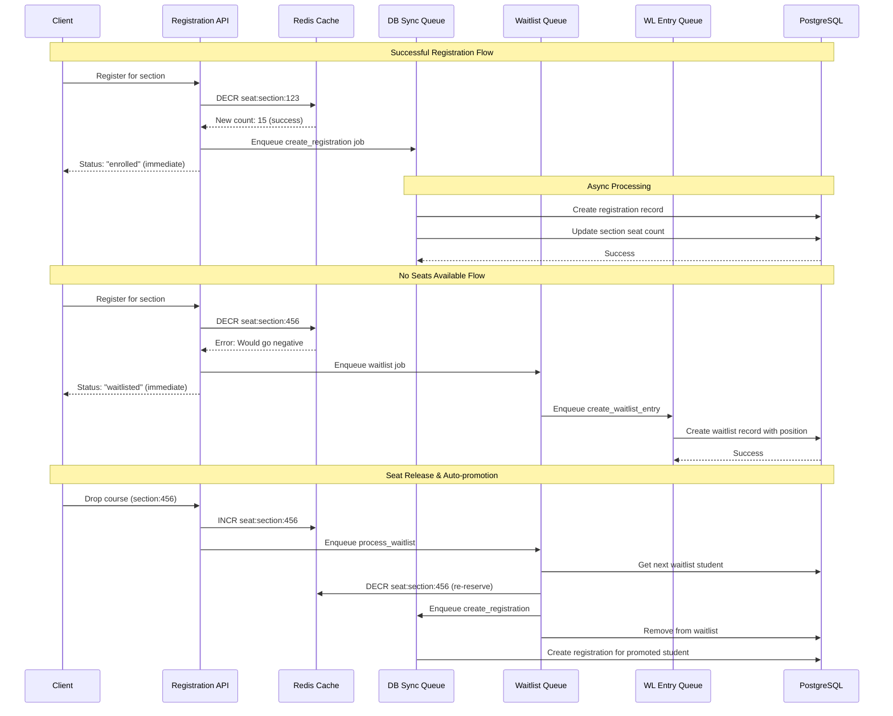

## API Endpoints

### Complete Endpoint Overview

Our REST API provides **6 main endpoints** for course registration operations:

```mermaid
%%{init: {'flowchart': {'htmlLabels': true}}}%%
graph LR
    subgraph "API Endpoints"
        subgraph "Registration Operations"
            Register[POST /api/v1/register<br/>Register for courses]
            Drop[POST /api/v1/register/drop<br/>Drop a course]
        end
        
        subgraph "Student Information"
            GetReg[GET /api/v1/students/&#123;id&#125;/registrations<br/>Get student registrations]
            GetWait[GET /api/v1/students/&#123;id&#125;/waitlist<br/>Get waitlist status]
        end
        
        subgraph "Course Information" 
            GetSections[GET /api/v1/sections/available<br/>Get available sections]
        end
        
        subgraph "System Health"
            Health[GET /health<br/>System health check]
            Ready[GET /ready<br/>Readiness probe]
            Live[GET /live<br/>Liveness probe]
        end
    end
    
    style Register fill:#c8e6c9
    style Drop fill:#ffcdd2
    style GetReg fill:#e1f5fe
    style GetWait fill:#e1f5fe
    style GetSections fill:#fff3e0
    style Health fill:#f3e5f5
    style Ready fill:#f3e5f5
    style Live fill:#f3e5f5

```

### Detailed Endpoint Specifications

#### 1. Course Registration

**Endpoint**: `POST /api/v1/register`

**Request**:
```json
{
  "student_id": "123e4567-e89b-12d3-a456-426614174000",
  "section_ids": [
    "789e0123-e45b-67c8-d901-234567890123",
    "456e7890-e12b-34c5-f678-901234567890"
  ],
  "idempotency_key": "reg-2025-08-26-unique-001" // Optional
}
```

**Headers** (Alternative to body key):
```
Idempotency-Key: reg-2025-08-26-unique-001
Content-Type: application/json
```

**Response**:
```json
{
  "success": true,
  "message": "Registration processed successfully",
  "data": {
    "results": [
      {
        "section_id": "789e0123-e45b-67c8-d901-234567890123",
        "status": "enrolled",
        "message": "Successfully registered",
        "registration_id": "reg-uuid-here"
      },
      {
        "section_id": "456e7890-e12b-34c5-f678-901234567890", 
        "status": "waitlisted",
        "message": "Added to waitlist - position 3",
        "waitlist_position": 3
      }
    ],
    "summary": {
      "total_requested": 2,
      "enrolled": 1,
      "waitlisted": 1,
      "already_registered": 0,
      "errors": 0
    }
  }
}
```

#### 2. Drop Course

**Endpoint**: `POST /api/v1/register/drop`

**Request**:
```json
{
  "student_id": "123e4567-e89b-12d3-a456-426614174000",
  "section_id": "789e0123-e45b-67c8-d901-234567890123"
}
```

**Response**:
```json
{
  "success": true,
  "message": "Course dropped successfully",
  "data": {
    "section_id": "789e0123-e45b-67c8-d901-234567890123",
    "student_id": "123e4567-e89b-12d3-a456-426614174000",
    "dropped_at": "2025-08-26T10:30:00Z",
    "seat_released": true,
    "waitlist_processed": true,
    "promoted_student_id": "456e7890-e12b-34c5-f678-901234567890"
  }
}
```

#### 3. Get Available Sections

**Endpoint**: `GET /api/v1/sections/available`

**Query Parameters**:
- `semester_id` (required): UUID of the semester
- `course_id` (optional): Filter by specific course

**Example**: `GET /api/v1/sections/available?semester_id=sem-uuid&course_id=course-uuid`

**Response**:
```json
{
  "success": true,
  "message": "Available sections retrieved successfully",
  "data": {
    "sections": [
      {
        "section_id": "789e0123-e45b-67c8-d901-234567890123",
        "course": {
          "course_id": "course-uuid",
          "course_code": "CS101",
          "course_name": "Introduction to Computer Science"
        },
        "section_number": "001",
        "total_seats": 30,
        "available_seats": 15,
        "instructor": "Dr. Smith",
        "schedule": {
          "days": ["Monday", "Wednesday", "Friday"],
          "time": "10:00-11:00 AM",
          "location": "Room 101"
        }
      }
    ],
    "total_sections": 1,
    "total_available_seats": 15
  }
}
```

#### 4. Get Student Registrations

**Endpoint**: `GET /api/v1/students/{student_id}/registrations`

**Response**:
```json
{
  "success": true,
  "message": "Student registrations retrieved successfully",
  "data": {
    "registrations": [
      {
        "registration_id": "reg-uuid",
        "section": {
          "section_id": "section-uuid", 
          "course_code": "CS101",
          "course_name": "Introduction to Computer Science",
          "section_number": "001"
        },
        "status": "enrolled",
        "registration_date": "2025-08-26T09:15:00Z",
        "grade": null
      }
    ],
    "total_registrations": 1,
    "enrolled_credits": 3
  }
}
```

#### 5. Get Waitlist Status

**Endpoint**: `GET /api/v1/students/{student_id}/waitlist`

**Response**:
```json
{
  "success": true,
  "message": "Waitlist status retrieved successfully", 
  "data": {
    "waitlist_entries": [
      {
        "waitlist_id": "wl-uuid",
        "section": {
          "section_id": "section-uuid",
          "course_code": "CS201", 
          "course_name": "Data Structures",
          "section_number": "002"
        },
        "position": 3,
        "estimated_wait_time": "2-3 days",
        "added_at": "2025-08-26T08:30:00Z",
        "expires_at": "2025-09-15T23:59:59Z"
      }
    ],
    "total_waitlist_entries": 1
  }
}
```

#### 6. Health Endpoints

**Health Check**: `GET /health`
```json
{
  "status": "healthy",
  "timestamp": "2025-08-26T10:30:00Z",
  "version": "1.0.0",
  "services": {
    "database": "healthy",
    "cache": "healthy",
    "queue": "healthy"
  }
}
```

**Readiness Check**: `GET /ready`
```json
{
  "ready": true,
  "timestamp": "2025-08-26T10:30:00Z"
}
```

**Liveness Check**: `GET /live`
```json
{
  "alive": true,
  "timestamp": "2025-08-26T10:30:00Z"
}
```

## Sequence Diagrams

### 1. Complete Registration Flow

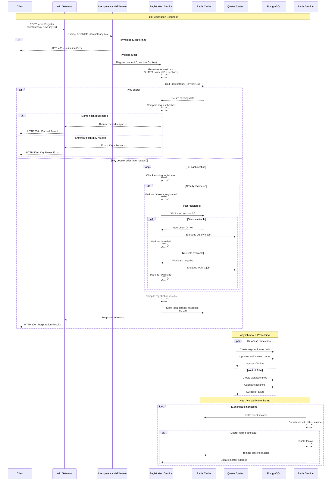

### 2. Waitlist Processing Flow

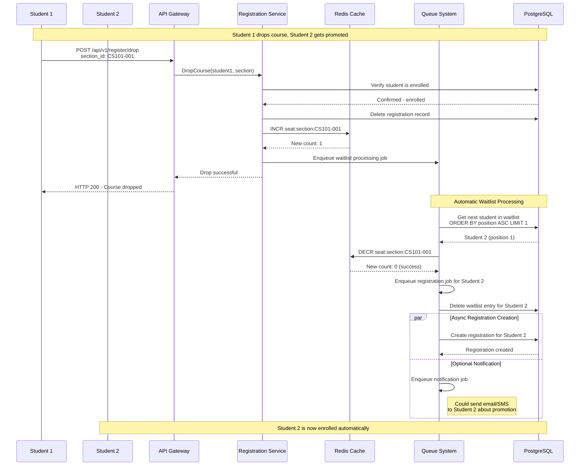

### 3. High Availability Failover Sequence

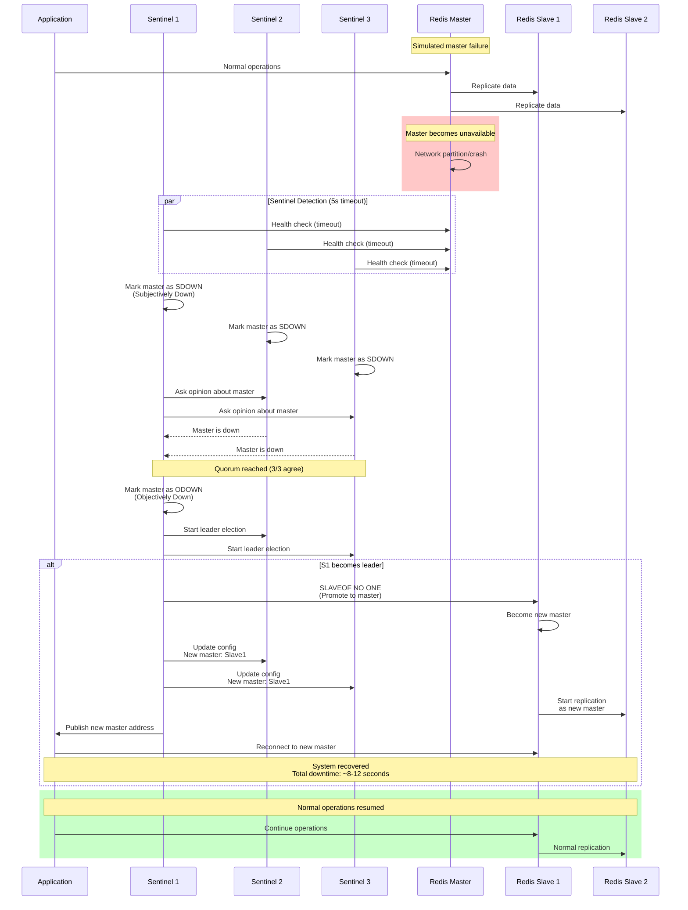

### 4. Idempotency Handling Sequence

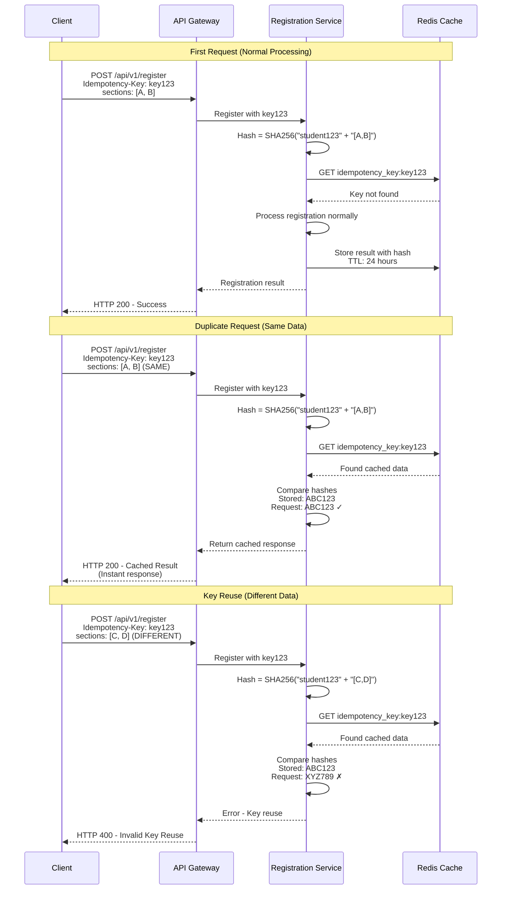

