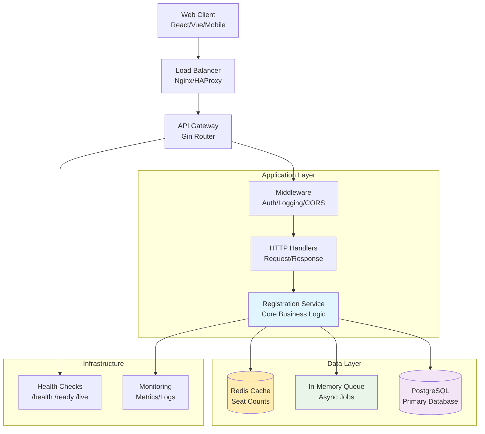
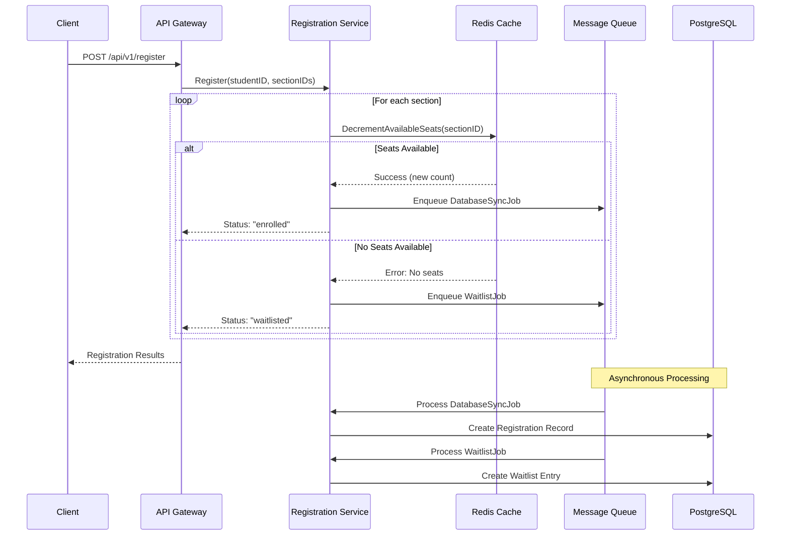
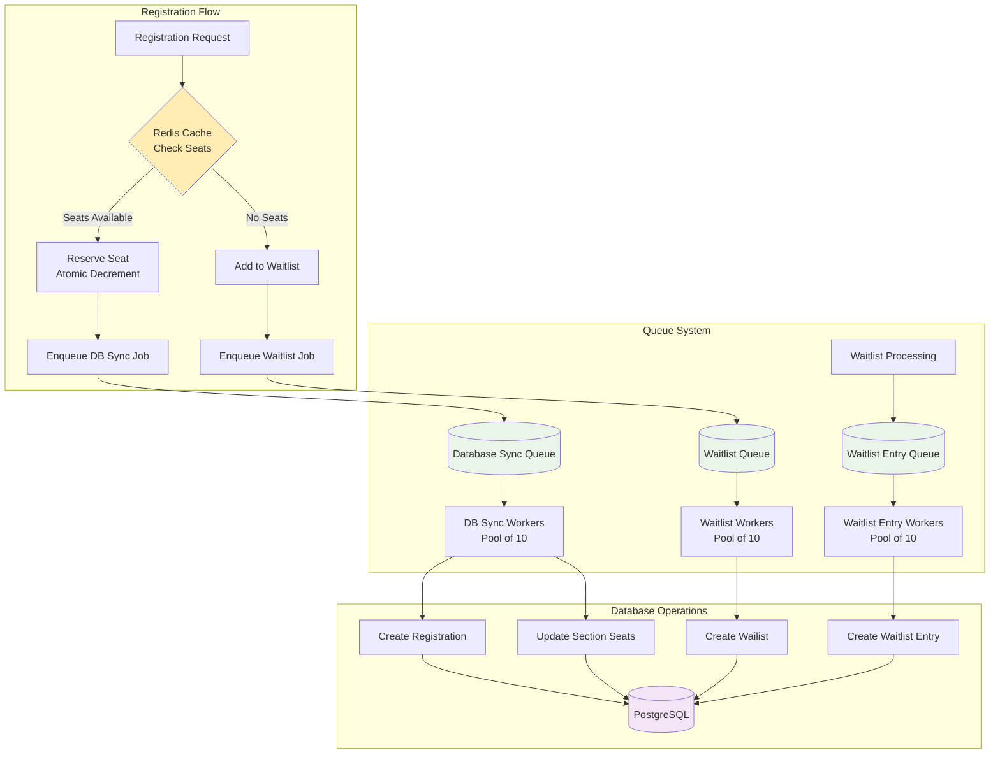
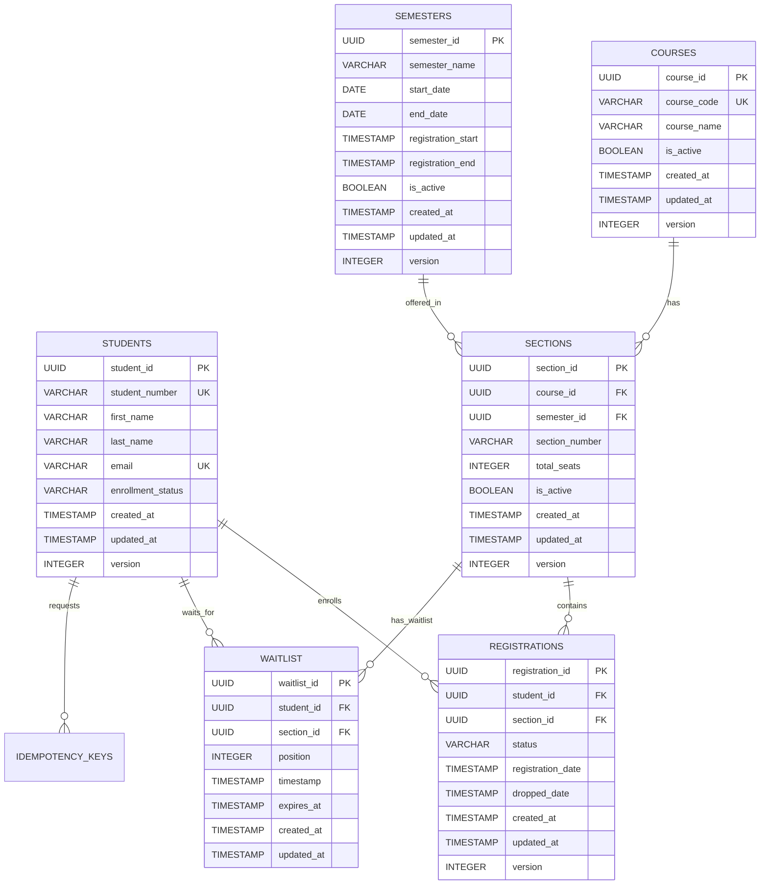
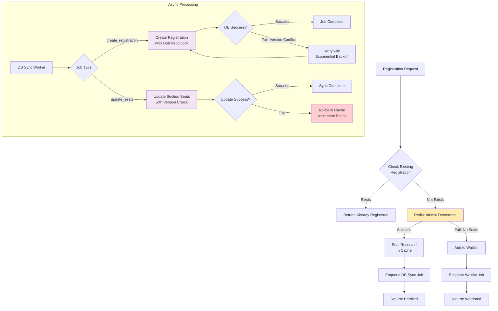

# Course Registration System - Architecture Documentation

## System Architecture Overview

The system follows a **microservices architecture** with **asynchronous processing** and **Redis caching** for high throughput. It's built using **Clean Architecture** principles with clear separation of concerns across layers.

### High-Level System Architecture



### Registration Flow Sequence



### Queue Processing Architecture



### Database Schema Relationships



### Concurrency Control Flow



## Use cases of redis data structure


## Idempotency and Duplicate Request Handling

The system implements **idempotency keys** to prevent duplicate registrations and ensure data consistency during network issues or client retries.

### Key Features

1. **Optional Idempotency Keys**: Clients can provide an idempotency key in the request body or `Idempotency-Key` header
2. **Automatic Duplicate Detection**: System compares request fingerprints to detect true duplicates
3. **Response Caching**: Successful responses are cached in Redis and returned for duplicate requests
4. **Configurable TTL**: Idempotency keys expire after 24 hours by default (stored in Redis)
5. **Error Handling**: Different request data with the same key returns an error
6. **High Performance**: Redis-based storage provides faster lookups and automatic cleanup

### Implementation Details

#### Request Fingerprinting
- Combines student ID and request data (section IDs) into a SHA-256 hash
- Ensures only identical requests are considered duplicates
- Prevents key reuse with different data

#### Storage and Cleanup
- **Idempotency keys stored in Redis** with automatic TTL-based expiration
- Keys expire automatically after 24 hours (configurable)
- **No database overhead** - Redis handles all idempotency key storage and cleanup
- **High performance** - Redis provides faster lookups compared to database queries
- **Memory efficient** - Automatic cleanup by Redis TTL mechanism

#### Usage Examples

**With idempotency key in request body:**
```json
{
  "student_id": "123e4567-e89b-12d3-a456-426614174000",
  "section_ids": ["789e0123-e45b-67c8-d901-234567890123"],
  "idempotency_key": "reg-2025-08-24-unique-key-001"
}
```

**With idempotency key in header:**
```bash
curl -X POST http://localhost:8080/api/v1/register \
  -H "Content-Type: application/json" \
  -H "Idempotency-Key: reg-2025-08-24-unique-key-001" \
  -d '{"student_id": "123e4567-e89b-12d3-a456-426614174000", "section_ids": ["789e0123-e45b-67c8-d901-234567890123"]}'
```

