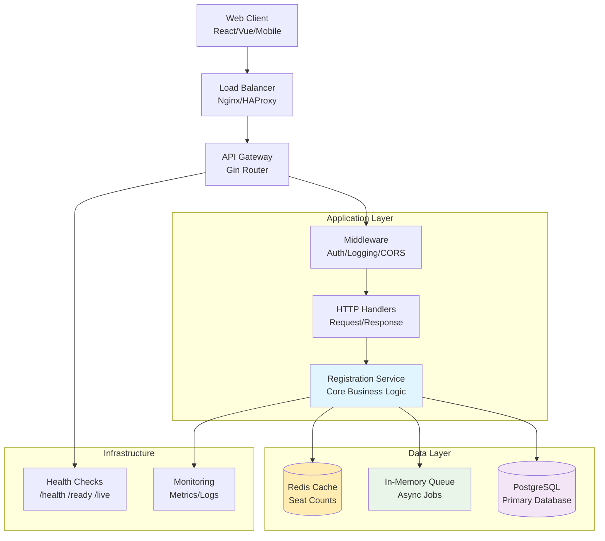
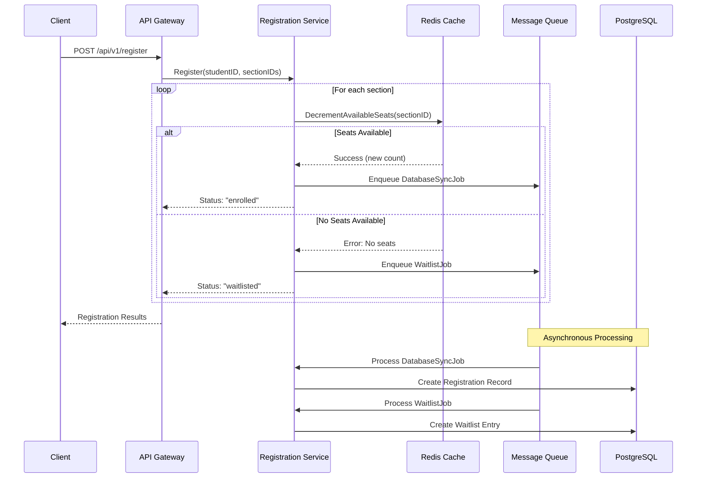
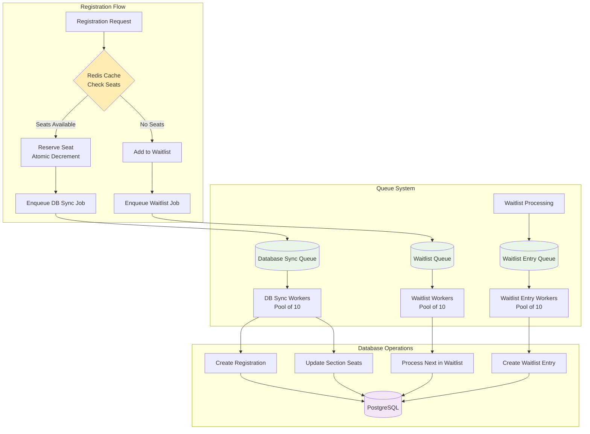
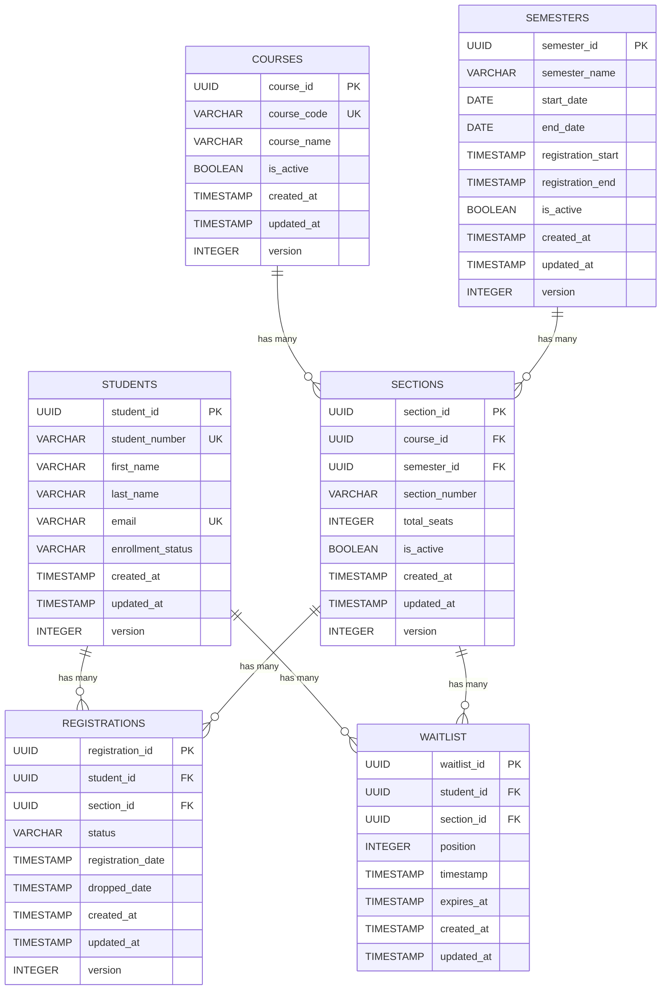
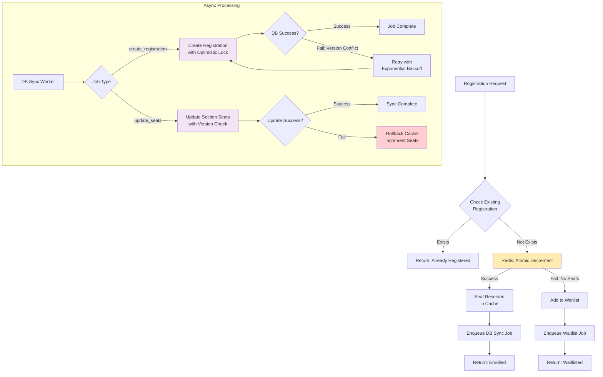

# Course Registration System - Architecture Documentation

## System Architecture Overview

The system follows a **microservices architecture** with **asynchronous processing** and **Redis caching** for high throughput. It's built using **Clean Architecture** principles with clear separation of concerns across layers.

### High-Level System Architecture



### Registration Flow Sequence



### Queue Processing Architecture



### Database Schema Relationships



### Concurrency Control Flow



## Part 1: System Components and Design

### Core System Components

#### 1. **HTTP API Layer** (Gin Framework)
- **Router**: `/api/v1` RESTful endpoints with middleware
- **Handlers**: Request validation, response formatting, error handling
- **Middleware**: Logging, CORS, authentication, rate limiting
- **Health Checks**: `/health`, `/ready`, `/live` endpoints

#### 2. **Registration Service** (Business Logic Core)
- **Primary Responsibility**: Course registration orchestration
- **Key Features**:
  - Concurrent seat management with optimistic locking
  - Automatic waitlist handling
  - Cache-first strategy for performance
  - Asynchronous database synchronization
  - Retry logic with exponential backoff

#### 3. **Repository Layer** (Data Access)
- **Student Repository**: Student profile and eligibility management
- **Section Repository**: Course section and capacity management
- **Registration Repository**: Registration records and status tracking
- **Waitlist Repository**: Waitlist position and queue management

#### 4. **Caching Layer** (Redis)
- **Purpose**: High-speed seat availability checks and atomic operations
- **Key Patterns**:
  - `section:seats:{section_id}` - Real-time seat counts
  - Atomic increment/decrement operations
  - Cache-aside pattern with database fallback

#### 5. **Queue System** (In-Memory Channels)
- **Database Sync Queue**: Asynchronous registration record creation
- **Waitlist Processing Queue**: Automated waitlist advancement
- **Worker Pool**: Concurrent job processing with error handling

#### 6. **Database Layer** (PostgreSQL with GORM)
- **ACID Compliance**: Transaction safety for critical operations
- **Optimistic Locking**: Version-based conflict resolution
- **Connection Pooling**: Efficient database resource management
- **Auto Migration**: Schema management and updates

### Database Schema Design

The system uses PostgreSQL with optimistic locking and referential integrity:

#### Students Table

```sql
CREATE TABLE students (
    student_id UUID PRIMARY KEY DEFAULT uuid_generate_v4(),
    student_number VARCHAR(20) UNIQUE NOT NULL,
    first_name VARCHAR(100) NOT NULL,
    last_name VARCHAR(100) NOT NULL,
    email VARCHAR(255) UNIQUE NOT NULL,
    enrollment_status VARCHAR(20) DEFAULT 'active',
    created_at TIMESTAMP WITH TIME ZONE DEFAULT NOW(),
    updated_at TIMESTAMP WITH TIME ZONE DEFAULT NOW(),
    version INTEGER DEFAULT 1
);
```

#### Courses Table

```sql
CREATE TABLE courses (
    course_id UUID PRIMARY KEY DEFAULT uuid_generate_v4(),
    course_code VARCHAR(20) UNIQUE NOT NULL,
    course_name VARCHAR(200) NOT NULL,
    is_active BOOLEAN DEFAULT true,
    created_at TIMESTAMP WITH TIME ZONE DEFAULT NOW(),
    updated_at TIMESTAMP WITH TIME ZONE DEFAULT NOW(),
    version INTEGER DEFAULT 1
);
```

#### Semesters Table

```sql
CREATE TABLE semesters (
    semester_id UUID PRIMARY KEY DEFAULT uuid_generate_v4(),
    semester_name VARCHAR(50) NOT NULL,
    start_date DATE NOT NULL,
    end_date DATE NOT NULL,
    registration_start TIMESTAMP WITH TIME ZONE NOT NULL,
    registration_end TIMESTAMP WITH TIME ZONE NOT NULL,
    is_active BOOLEAN DEFAULT true,
    created_at TIMESTAMP WITH TIME ZONE DEFAULT NOW(),
    updated_at TIMESTAMP WITH TIME ZONE DEFAULT NOW(),
    version INTEGER DEFAULT 1
);
```

#### Sections Table (Critical for Concurrency)

```sql
CREATE TABLE sections (
    section_id UUID PRIMARY KEY DEFAULT uuid_generate_v4(),
    course_id UUID NOT NULL REFERENCES courses(course_id),
    semester_id UUID NOT NULL REFERENCES semesters(semester_id),
    section_number VARCHAR(10) NOT NULL,
    total_seats INTEGER NOT NULL CHECK (total_seats > 0),
    is_active BOOLEAN DEFAULT true,
    created_at TIMESTAMP WITH TIME ZONE DEFAULT NOW(),
    updated_at TIMESTAMP WITH TIME ZONE DEFAULT NOW(),
    version INTEGER DEFAULT 1, -- Critical for optimistic locking
    UNIQUE(course_id, semester_id, section_number)
);
```

#### Registrations Table

```sql
CREATE TABLE registrations (
    registration_id UUID PRIMARY KEY DEFAULT uuid_generate_v4(),
    student_id UUID NOT NULL REFERENCES students(student_id),
    section_id UUID NOT NULL REFERENCES sections(section_id),
    status VARCHAR(20) NOT NULL DEFAULT 'enrolled',
    registration_date TIMESTAMP WITH TIME ZONE DEFAULT NOW(),
    dropped_date TIMESTAMP WITH TIME ZONE,
    created_at TIMESTAMP WITH TIME ZONE DEFAULT NOW(),
    updated_at TIMESTAMP WITH TIME ZONE DEFAULT NOW(),
    version INTEGER DEFAULT 1,
    UNIQUE(student_id, section_id)
);
```

#### Waitlist Table

```sql
CREATE TABLE waitlist (
    waitlist_id UUID PRIMARY KEY DEFAULT uuid_generate_v4(),
    student_id UUID NOT NULL REFERENCES students(student_id),
    section_id UUID NOT NULL REFERENCES sections(section_id),
    position INTEGER NOT NULL,
    timestamp TIMESTAMP WITH TIME ZONE DEFAULT NOW(),
    expires_at TIMESTAMP WITH TIME ZONE,
    created_at TIMESTAMP WITH TIME ZONE DEFAULT NOW(),
    updated_at TIMESTAMP WITH TIME ZONE DEFAULT NOW(),
    UNIQUE(student_id, section_id)
);
```

## Part 2: Core Registration Logic and Implementation

### API Endpoints

The system exposes the following RESTful endpoints:

**Registration Operations:**
- `POST /api/v1/register` - Register for multiple courses
- `POST /api/v1/register/drop` - Drop a course

**Query Operations:**
- `GET /api/v1/students/{id}/registrations` - Get student's current registrations
- `GET /api/v1/students/{id}/waitlist` - Get student's waitlist status
- `GET /api/v1/sections/available` - Get available course sections

**System Health:**
- `GET /health` - Basic health check
- `GET /ready` - Readiness probe
- `GET /live` - Liveness probe


### Registration Flow Architecture


#### High-Level Registration Process


```go
func (s *RegistrationService) Register(ctx context.Context, req *RegisterRequest) (*RegisterResponse, error) {
    // 1. Validate student eligibility
    student, err := s.studentRepo.GetByID(ctx, req.StudentID)
    if err != nil || student.EnrollmentStatus != "active" {
        return nil, errors.New("student not eligible for registration")
    }

    // 2. Process each section registration
    response := &RegisterResponse{Results: make([]RegistrationResult, 0)}
    for _, sectionID := range req.SectionIDs {
        result := s.registerForSection(ctx, req.StudentID, sectionID)
        response.Results = append(response.Results, result)
    }
    
    return response, nil
}
```

#### Individual Section Registration Logic

```go
func (s *RegistrationService) registerForSection(ctx context.Context, studentID, sectionID uuid.UUID) RegistrationResult {
    // 1. Check for existing registration
    existing, err := s.registrationRepo.GetByStudentAndSection(ctx, studentID, sectionID)
    if existing != nil {
        return RegistrationResult{Status: "already_registered"}
    }

    // 2. Attempt atomic seat reservation in cache
    newSeatCount, err := s.cacheService.DecrementAndGetAvailableSeats(ctx, sectionID)
    if err != nil {
        // No seats available - add to waitlist
        position, _ := s.addToWaitlist(ctx, studentID, sectionID)
        return RegistrationResult{Status: "waitlisted", Position: &position}
    }

    // 3. Enqueue database synchronization job
    dbSyncJob := interfaces.DatabaseSyncJob{
        JobType:   "create_registration",
        StudentID: studentID,
        SectionID: sectionID,
        Timestamp: time.Now(),
    }
    
    s.queueService.EnqueueDatabaseSync(ctx, dbSyncJob)
    return RegistrationResult{Status: "enrolled"}
}
```

### Concurrency Control Strategy

#### Cache-First Approach with Optimistic Locking

The system uses a **cache-first approach** for performance with database optimistic locking for consistency:

1. **Redis Atomic Operations**: Use Redis atomic decrement for immediate seat reservation
2. **Asynchronous Database Sync**: Queue database updates for eventual consistency
3. **Optimistic Locking**: Handle race conditions with version-based conflict resolution
4. **Automatic Rollback**: Compensate cache operations if database sync fails

#### Redis Atomic Seat Management

```lua
-- Lua script for atomic seat decrement
local key = KEYS[1]
local current = redis.call("GET", key)
if current == false then
    return redis.error_reply("Key does not exist")
end
local value = tonumber(current)
if value <= 0 then
    return redis.error_reply("No seats available")
end
return redis.call("DECR", key)
```

#### Database Optimistic Locking Implementation

```sql
-- Optimistic locking with version check
UPDATE sections 
SET available_seats = $1, 
    version = version + 1, 
    updated_at = NOW()
WHERE section_id = $2 AND version = $3;
-- If RowsAffected = 0, optimistic lock failed - retry required
```

## Part 3: Asynchronous Processing and Queue System

### Queue Architecture

The system implements an **in-memory queue system** with multiple channels for different job types:

```go
type Queue struct {
    databaseSyncQueue  chan interfaces.DatabaseSyncJob // Registration persistence
    waitlistQueue      chan uuid.UUID                  // Waitlist processing
    waitlistEntryQueue chan interfaces.WaitlistJob     // Waitlist entry creation
    workers            int                             // Worker pool size
    registrationService serviceInterfaces.RegistrationService
}
```

### Queue Job Types

#### 1. Database Sync Jobs
**Purpose**: Asynchronously persist registration data to PostgreSQL

```go
type DatabaseSyncJob struct {
    JobType   string    // "create_registration" or "update_seats"
    StudentID uuid.UUID
    SectionID uuid.UUID
    Timestamp time.Time
}

func (s *RegistrationService) ProcessDatabaseSyncJob(ctx context.Context, job interfaces.DatabaseSyncJob) error {
    switch job.JobType {
    case "create_registration":
        return s.createRegistrationRecord(ctx, job.StudentID, job.SectionID)
    case "update_seats":
        return s.updateSectionSeats(ctx, job.SectionID)
    default:
        return fmt.Errorf("unknown job type: %s", job.JobType)
    }
}
```

#### 2. Waitlist Processing Jobs
**Purpose**: Automatically advance waitlisted students when seats become available

```go
func (s *RegistrationService) processWaitlist(ctx context.Context, sectionID uuid.UUID) error {
    // Get next student in waitlist
    nextEntry, err := s.waitlistRepo.GetNextInLine(ctx, sectionID)
    if err != nil || nextEntry == nil {
        return nil // No one in waitlist
    }

    // Check available seats in cache
    available, err := s.cacheService.GetAvailableSeats(ctx, sectionID)
    if err != nil || available <= 0 {
        return nil
    }

    // Reserve seat for waitlisted student
    newSeatCount, err := s.cacheService.DecrementAndGetAvailableSeats(ctx, sectionID)
    if err != nil {
        return nil
    }

    // Remove from waitlist
    if err := s.waitlistRepo.Delete(ctx, nextEntry.WaitlistID); err != nil {
        // Rollback cache change
        s.cacheService.IncrementAvailableSeats(ctx, sectionID)
        return fmt.Errorf("failed to remove from waitlist: %w", err)
    }

    // Create registration for waitlisted student
    dbSyncJob := interfaces.DatabaseSyncJob{
        JobType:   "create_registration",
        StudentID: nextEntry.StudentID,
        SectionID: sectionID,
        Timestamp: time.Now(),
    }
    
    return s.queueService.EnqueueDatabaseSync(ctx, dbSyncJob)
}
```

### Worker Pool Implementation

```go
func (q *Queue) StartWorkers() {
    q.mu.Lock()
    defer q.mu.Unlock()
    
    if q.started {
        return
    }

    for i := 0; i < q.workers; i++ {
        go q.databaseSyncWorker()
        go q.waitlistWorker()
        go q.waitlistEntryWorker()
    }
    
    q.started = true
    logger.Info("Started %d queue workers for each job type", q.workers)
}
```

### Caching Strategy (Cache-Aside Pattern)

#### Redis Key Patterns
- `section:seats:{section_id}` - Available seat count for each section
- `section:details:{section_id}` - Cached section information
- `student:registrations:{student_id}` - Student's current registrations

#### Cache Operations

```go
// Atomic seat decrement with availability check
func (r *RedisCache) DecrementAndGetAvailableSeats(ctx context.Context, sectionID uuid.UUID) (int, error) {
    key := fmt.Sprintf("section:seats:%s", sectionID)
    
    // Lua script ensures atomicity
    script := `
        local current = redis.call("GET", KEYS[1])
        if current == false then
            return redis.error_reply("Key does not exist")
        end
        local value = tonumber(current)
        if value <= 0 then
            return redis.error_reply("No seats available")
        end
        return redis.call("DECR", KEYS[1])
    `
    
    result, err := r.client.Eval(ctx, script, []string{key}).Result()
    if err != nil {
        return 0, err
    }
    
    return int(result.(int64)), nil
}
```

### Drop Course and Waitlist Management

```go
func (s *RegistrationService) DropCourse(ctx context.Context, studentID, sectionID uuid.UUID) error {
    // 1. Update registration status to 'dropped'
    registration, err := s.registrationRepo.GetByStudentAndSection(ctx, studentID, sectionID)
    if err != nil || registration == nil {
        return errors.New("registration not found")
    }
    
    registration.Status = "dropped"
    registration.DroppedDate = &time.Now()
    if err := s.registrationRepo.Update(ctx, registration); err != nil {
        return fmt.Errorf("failed to update registration: %w", err)
    }

    // 2. Increment available seats in cache
    if err := s.cacheService.IncrementAvailableSeats(ctx, sectionID); err != nil {
        logger.Error("Failed to increment seats in cache: %v", err)
    }

    // 3. Process waitlist for available seat
    return s.processWaitlist(ctx, sectionID)
}
```

## Part 4: Database Internals and Optimization

### Isolation Levels

**Chosen Level: READ COMMITTED**

**Rationale**:
- Prevents dirty reads
- Allows non-repeatable reads (acceptable for seat counts)
- Good balance between consistency and performance
- Avoids phantom read issues in our use case

**Alternative: REPEATABLE READ** for critical operations requiring strict consistency.

### Indexing Strategy

```sql
CREATE INDEX idx_registrations_student_section ON registrations(student_id, section_id);
CREATE INDEX idx_registrations_section_status ON registrations(section_id, status);
CREATE INDEX idx_sections_course_semester ON sections(course_id, semester_id);
CREATE INDEX idx_waitlist_section_position ON waitlist(section_id, position);
CREATE INDEX idx_students_student_number ON students(student_number);
CREATE INDEX idx_sections_semester_active ON sections(semester_id, is_active) 
WHERE is_active = true;
```

### Scalability Analysis

#### Horizontal Partitioning

**By Semester** (Recommended):
```sql
CREATE TABLE registrations_fall2024 PARTITION OF registrations
FOR VALUES FROM ('2024-08-01') TO ('2024-12-31');

CREATE TABLE registrations_spring2025 PARTITION OF registrations  
FOR VALUES FROM ('2025-01-01') TO ('2025-05-31');
```

**Benefits**:
- Natural data lifecycle (archive old semesters)
- Improved query performance for current semester
- Simplified backup/restore operations

#### Database Sharding (Massive Scale)

**Shard Key Options**:

1. **student_id**:
   - Pros: Even distribution, student-centric queries efficient
   - Cons: Cross-shard queries for course availability

2. **course_id**: 
   - Pros: Course-centric operations efficient
   - Cons: Uneven distribution (popular courses)

**Sharding Implementation**:
```
Shard 1: student_id hash % 4 = 0
Shard 2: student_id hash % 4 = 1  
Shard 3: student_id hash % 4 = 2
Shard 4: student_id hash % 4 = 3
```

## Part 5: System Deployment and Operations

### Docker Compose Setup

The system can be deployed using Docker Compose for local development and testing:

```yaml
services:
  postgres:
    image: postgres:15-alpine
    container_name: course_registration_postgres
    environment:
      POSTGRES_DB: course_registration
      POSTGRES_USER: postgres
      POSTGRES_PASSWORD: password123
    ports:
      - "5432:5432"
    volumes:
      - pgdata:/var/lib/postgresql/data
      - ./scripts/database_schema.sql:/docker-entrypoint-initdb.d/01-schema.sql
    healthcheck:
      test: ["CMD", "pg_isready", "-U", "postgres", "-d", "course_registration"]
      interval: 5s
      timeout: 5s
      retries: 10

  redis:
    image: redis:7-alpine
    container_name: course_registration_redis
    command: ["redis-server", "--appendonly", "yes", "--maxmemory", "256mb"]
    ports:
      - "6379:6379"
    volumes:
      - redis_data:/data

  app:
    build: .
    container_name: course_registration_app
    ports:
      - "8080:8080"
    depends_on:
      - postgres
      - redis
    environment:
      - DB_HOST=postgres
      - DB_PORT=5432
      - REDIS_HOST=redis
      - REDIS_PORT=6379
```

### System Commands and Operations

#### Start Registration Server

```bash
# Start with default configuration
./course-registration registration

# Start on custom port
./course-registration registration --port 8081

# Start with verbose logging
./course-registration registration --verbose
```

#### Available Endpoints Summary

```
🎓 Course Registration Server Endpoints:
  POST /api/v1/register              - Register for courses
  POST /api/v1/register/drop         - Drop a course
  GET  /api/v1/students/{id}/registrations - Get student registrations
  GET  /api/v1/students/{id}/waitlist      - Get waitlist status
  GET  /api/v1/sections/available          - Get available sections
  GET  /health                             - Health check
  GET  /ready                              - Readiness probe
  GET  /live                               - Liveness probe
```

#### Health Monitoring Implementation

```go
// Health check implementation
func (h *HealthHandler) HealthCheck(c *gin.Context) {
    status := make(map[string]interface{})
    
    // Database health
    if err := h.db.DB().Ping(); err != nil {
        status["database"] = "unhealthy"
        status["error"] = err.Error()
        c.JSON(http.StatusServiceUnavailable, status)
        return
    }
    status["database"] = "healthy"
    
    // Redis health
    if err := h.redis.Ping(c.Request.Context()).Err(); err != nil {
        status["redis"] = "unhealthy"
        status["error"] = err.Error()
        c.JSON(http.StatusServiceUnavailable, status)
        return
    }
    status["redis"] = "healthy"
    
    status["status"] = "healthy"
    status["timestamp"] = time.Now()
    c.JSON(http.StatusOK, status)
}
```

### Scalability Considerations

#### Horizontal Scaling Strategies
- **Stateless Design**: All state stored in database or cache
- **Database Read Replicas**: Separate read and write operations
- **Redis Clustering**: Distributed cache for high availability
- **Load Balancing**: Multiple application instances behind load balancer

